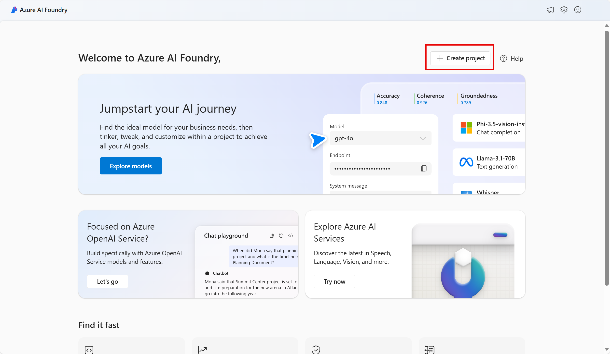
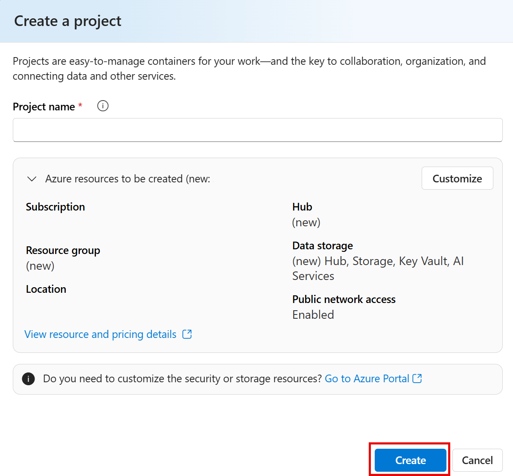

# projeto_3-dio-ai
## Explorando Recursos de IA Generativa com Copilot e OpenAI
Este conteúdo apresenta uma introdução à IA generativa e demonstra como experimentar suas capacidades no Azure AI Foundry, a plataforma da Microsoft para desenvolvimento de aplicações inteligentes.
A IA generativa é um campo da inteligência artificial voltado para a criação de conteúdo, frequentemente utilizado em aplicativos de bate-papo. O guia propõe um exercício prático no Azure AI Foundry, ensinando como criar um projeto e configurar um ambiente para experimentação.
A seguir um breve Passo a Passo da configuração:

## Criação do Projeto no Azure AI Foundry
1. Introdução à IA Generativa e Azure AI Foundry
- A IA generativa cria conteúdo automaticamente e é utilizada em aplicativos de bate-papo. (para essa parte utilizamos o Microsoft Copilot)
- O Azure AI Foundry é a plataforma da Microsoft para desenvolver aplicações inteligentes.
### 2. Criando um Projeto no Azure AI Foundry
  
1. Acesse o Azure AI Foundry e faça login.
2. Clique em "Create a project" para criar um projeto.

  
3. Escolha um nome e, se necessário, crie um hub de IA.
4. Selecione um local para os serviços (East US, France Central, etc.).
5. Recursos criados automaticamente:
- Serviços de IA do Azure
- Hub de IA
- Conta de Armazenamento
- Cofre de Chaves
- Grupo de Recursos
6. Acesse a aba "Playgrounds" no menu lateral.
### 3. Explorando o Chat Playground
  
1. No Playgrounds, selecione "Try the Chat playground".
2. Crie uma implantação selecionando o modelo GPT-4.
3. Aguarde a ativação e aplique as configurações.

### 4. Melhorando as Respostas da IA
- Defina uma meta: O que deseja que o assistente faça?
- Itere com base nas respostas: Ajuste os prompts para refinar os resultados.
- Forneça fontes: Use referências confiáveis para embasar a resposta.
- Adicione contexto: Torne as respostas mais precisas e relevantes.
- Defina expectativas claras: Especifique o formato desejado.

### 5. Testando Prompts
1. Criação de um itinerário: "I'm planning a trip to Paris in September. Can you help me?"

2. Sugestões de hospedagem: "Where's a good location in Paris to stay?"

3. Opções de restaurantes: "Can you give me more information about dining options near the first location?"

4. História da cidade: "Based on the information at Wikipedia, what were the key events in Paris' history?"

5. Sugestões detalhadas: "What three places do you recommend I stay to be near historical attractions?"

6. Lista ordenada: "What are the top 10 sights to see in Paris? Answer with a numbered list."

## Conclusão
O exercício conduz o usuário por diferentes tipos de prompts para aprimorar a resposta da IA, desde recomendações turísticas em Paris até o fornecimento de informações históricas fundamentadas em fontes específicas.
O Azure AI Foundry é uma ferramenta poderosa para explorar a IA generativa de forma prática. O guia ensina como criar e configurar um ambiente de teste, interagir com um modelo de IA e aprimorar a relevância das respostas por meio de estratégias de refinamento. Ao seguir essas etapas, os usuários aprendem a otimizar o desempenho de um assistente de IA, tornando suas respostas mais precisas e contextualmente relevantes.

## Insights e Pontos-Chave
 ✅ O Azure AI Foundry facilita a experimentação de IA generativa com uma interface amigável.
 ✅ A implantação de modelos como o GPT-4 permite criar assistentes de IA ajustáveis.
 ✅ A qualidade das respostas pode ser melhorada com prompts bem definidos, iteração constante e referências confiáveis.
 ✅ A capacidade de fornecer contexto e expectativas claras resulta em respostas mais úteis e organizadas.

## Observações
Neste projeto também realizamos alguns experimentos no microsoft copilot no repositório adicionei em uma pasta inputs e output que contém resultados do  experimento. 

## Fontes
http://microsoftlearning.github.io/mslearn-ai-fundamentals/Instructions/Labs/12-generative-ai.html
https://copilot.microsoft.com/chats/fvd4zHKNopS1watXrKbNs
